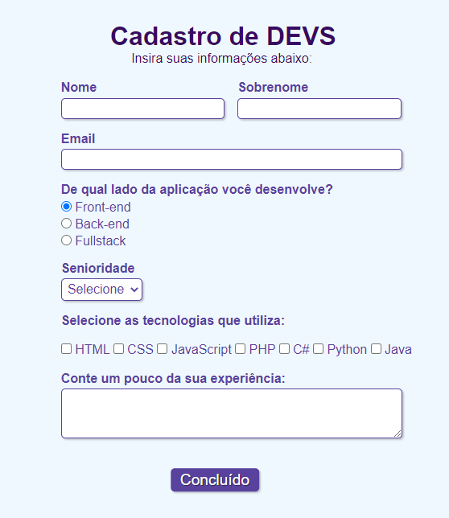

# FormTestingPossibilities
>A Project to learn more about Forms and its possibilities

Deployment ˚ ༘✶ ⋆｡˚ ⁀➷[_here_](https://rhanateix.github.io/FormTestingPossibilities/?target=_blank)

## Table of Contents
* [General Info](#general-information)
* [Technologies Used](#technologies-used)
* [Notes](#notes)
* [Screenshots](#screenshots)
* [Project Status](#project-status)
* [Room for Improvement](#room-for-improvement)
* [Acknowledgements](#acknowledgements)
* [Contact](#contact)

»»————-　★　————-««»»————-　★　————-««»»————-　★　————-««»»————-　★　————-««»»————-　★　

## General Information

- What problem does it (intend to) solve? Direct ways to get feedback/info  from users
- What is the purpose of your project? Explore the <form> tag and its possibilities
- Why did you undertake it? I want to improve my skills and learn more about the tecnologies used in this challenge

## Technologies Used
- HTML5
- CSS3

## Notes
  
  ˚ ༘✶ ⋆｡˚ ⁀➷ This project was made by and with the purpose of using the most tags used in HTML Forms as possible. 
  Even though the final result is in PT-BR all the code was written in EN.
  
  
## Screenshots

## Project Status
Project is: / _complete_ / -Since the purpose was to provide a version as close as to the original.

## Room for Improvement

  I would like to create my own version of those forms with JS and some more visual effects in the near future.

Room for improvement:
- Explore different CSS style options
- Add JS to more refined effects and appearence

## Acknowledgements

- This project was inspired by this [video tutorial](https://www.youtube.com/watch?v=wwqOJ2o84S4)
- Many thanks to [Rafaela Ballerini](https://github.com/rafaballerini)• ₊°✧︡ ˗ ˏ ˋ ♡ ˎˊ ˗

## Contact
Created by [@RhanaTeix](https://www.linkedin.com/in/rhan%C3%A1-teixeira-111181227/) - feel free to contact me!

»»————-　★　————-««»»————-　★　————-««»»————-　★　————-««»»————-　★　————-««»»————-　★　

  
